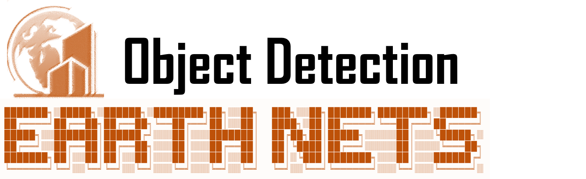

## Introduction

<div  align="center">    
 
</div>

## Installation

Please refer to [Installation] for installation instructions.

## Getting Started
We follow the same design with MMDetection to enable a deep connection with the computer vision community. 

Please see [get_started.md](docs/en/get_started.md) for the basic usage of MMDetection. We provide [colab tutorial](demo/MMDet_Tutorial.ipynb) and [instance segmentation colab tutorial](demo/MMDet_InstanceSeg_Tutorial.ipynb), and other tutorials for:

- [customize data pipelines](docs/en/tutorials/data_pipeline.md)
- [customize_models](docs/en/tutorials/customize_models.md)
- [customize runtime settings](docs/en/tutorials/customize_runtime.md)
- [customize_losses](docs/en/tutorials/customize_losses.md)
- [finetuning models](docs/en/tutorials/finetune.md)
- [export a model to ONNX](docs/en/tutorials/pytorch2onnx.md)
- [export ONNX to TRT](docs/en/tutorials/onnx2tensorrt.md)
- [weight initialization](docs/en/tutorials/init_cfg.md)
- [how to xxx](docs/en/tutorials/how_to.md)

## Overview of Benchmark and Model Zoo

Results and models are available in the [model zoo](docs/en/model_zoo.md).

<div align="center">
  <b>Architectures</b>
</div>
<table align="center">
  <tbody>
    <tr align="center" valign="bottom">
      <td>
        <b>Object Detection</b>
      </td>
      <td>
        <b>Instance Segmentation</b>
      </td>
      <td>
        <b>Panoptic Segmentation</b>
      </td>
      <td>
        <b>Other</b>
      </td>
    </tr>
    <tr valign="top">
      <td>
        <ul>
            <li><a href="configs/fast_rcnn">Fast R-CNN (ICCV'2015)</a></li>
            <li><a href="configs/faster_rcnn">Faster R-CNN (NeurIPS'2015)</a></li>
            <li><a href="configs/rpn">RPN (NeurIPS'2015)</a></li>
            <li><a href="configs/ssd">SSD (ECCV'2016)</a></li>
            <li><a href="configs/retinanet">RetinaNet (ICCV'2017)</a></li>
            <li><a href="configs/cascade_rcnn">Cascade R-CNN (CVPR'2018)</a></li>
            <li><a href="configs/yolo">YOLOv3 (ArXiv'2018)</a></li>
            <li><a href="configs/cornernet">CornerNet (ECCV'2018)</a></li>
            <li><a href="configs/grid_rcnn">Grid R-CNN (CVPR'2019)</a></li>
            <li><a href="configs/guided_anchoring">Guided Anchoring (CVPR'2019)</a></li>
            <li><a href="configs/fsaf">FSAF (CVPR'2019)</a></li>
            <li><a href="configs/centernet">CenterNet (ArXiv'2019)</a></li>
            <li><a href="configs/libra_rcnn">Libra R-CNN (CVPR'2019)</a></li>
            <li><a href="configs/tridentnet">TridentNet (ICCV'2019)</a></li>
            <li><a href="configs/fcos">FCOS (ICCV'2019)</a></li>
            <li><a href="configs/reppoints">RepPoints (ICCV'2019)</a></li>
            <li><a href="configs/free_anchor">FreeAnchor (NeurIPS'2019)</a></li>
            <li><a href="configs/cascade_rpn">CascadeRPN (NeurIPS'2019)</a></li>
            <li><a href="configs/foveabox">Foveabox (TIP'2020)</a></li>
            <li><a href="configs/double_heads">Double-Head R-CNN (CVPR'2020)</a></li>
            <li><a href="configs/atss">ATSS (CVPR'2020)</a></li>
            <li><a href="configs/nas_fcos">NAS-FCOS (CVPR'2020)</a></li>
            <li><a href="configs/centripetalnet">CentripetalNet (CVPR'2020)</a></li>
            <li><a href="configs/autoassign">AutoAssign (ArXiv'2020)</a></li>
            <li><a href="configs/sabl">Side-Aware Boundary Localization (ECCV'2020)</a></li>
            <li><a href="configs/dynamic_rcnn">Dynamic R-CNN (ECCV'2020)</a></li>
            <li><a href="configs/detr">DETR (ECCV'2020)</a></li>
            <li><a href="configs/paa">PAA (ECCV'2020)</a></li>
            <li><a href="configs/vfnet">VarifocalNet (CVPR'2021)</a></li>
            <li><a href="configs/sparse_rcnn">Sparse R-CNN (CVPR'2021)</a></li>
            <li><a href="configs/yolof">YOLOF (CVPR'2021)</a></li>
            <li><a href="configs/yolox">YOLOX (ArXiv'2021)</a></li>
            <li><a href="configs/deformable_detr">Deformable DETR (ICLR'2021)</a></li>
            <li><a href="configs/tood">TOOD (ICCV'2021)</a></li>
            <li><a href="configs/ddod">DDOD (ACM MM'2021)</a></li>
      </ul>
      </td>
      <td>
        <ul>
          <li><a href="configs/mask_rcnn">Mask R-CNN (ICCV'2017)</a></li>
          <li><a href="configs/cascade_rcnn">Cascade Mask R-CNN (CVPR'2018)</a></li>
          <li><a href="configs/ms_rcnn">Mask Scoring R-CNN (CVPR'2019)</a></li>
          <li><a href="configs/htc">Hybrid Task Cascade (CVPR'2019)</a></li>
          <li><a href="configs/yolact">YOLACT (ICCV'2019)</a></li>
          <li><a href="configs/instaboost">InstaBoost (ICCV'2019)</a></li>
          <li><a href="configs/solo">SOLO (ECCV'2020)</a></li>
          <li><a href="configs/point_rend">PointRend (CVPR'2020)</a></li>
          <li><a href="configs/detectors">DetectoRS (CVPR'2021)</a></li>
          <li><a href="configs/solov2">SOLOv2 (NeurIPS'2020)</a></li>
          <li><a href="configs/scnet">SCNet (AAAI'2021)</a></li>
          <li><a href="configs/queryinst">QueryInst (ICCV'2021)</a></li>
          <li><a href="configs/mask2former">Mask2Former (CVPR'2022)</a></li>
        </ul>
      </td>
      <td>
        <ul>
          <li><a href="configs/panoptic_fpn">Panoptic FPN (CVPR'2019)</a></li>
          <li><a href="configs/maskformer">MaskFormer (NeurIPS'2021)</a></li>
          <li><a href="configs/mask2former">Mask2Former (CVPR'2022)</a></li>
        </ul>
      </td>
      <td>
        </ul>
          <li><b>Contrastive Learning</b></li>
        <ul>
        <ul>
          <li><a href="configs/selfsup_pretrain">SwAV (NeurIPS'2020)</a></li>
          <li><a href="configs/selfsup_pretrain">MoCo (CVPR'2020)</a></li>
          <li><a href="configs/selfsup_pretrain">MoCov2 (ArXiv'2020)</a></li>
        </ul>
        </ul>
        </ul>
          <li><b>Distillation</b></li>
        <ul>
        <ul>
          <li><a href="configs/ld">Localization Distillation (CVPR'2022)</a></li>
          <li><a href="configs/lad">Label Assignment Distillation (WACV'2022)</a></li>
        </ul>
        </ul>
      </ul>
      </td>
    </tr>
</td>
    </tr>
  </tbody>
</table>

<div align="center">
  <b>Components</b>
</div>
<table align="center">
  <tbody>
    <tr align="center" valign="bottom">
      <td>
        <b>Backbones</b>
      </td>
      <td>
        <b>Necks</b>
      </td>
      <td>
        <b>Loss</b>
      </td>
      <td>
        <b>Common</b>
      </td>
    </tr>
    <tr valign="top">
      <td>
      <ul>
        <li>VGG (ICLR'2015)</li>
        <li>ResNet (CVPR'2016)</li>
        <li>ResNeXt (CVPR'2017)</li>
        <li>MobileNetV2 (CVPR'2018)</li>
        <li><a href="configs/hrnet">HRNet (CVPR'2019)</a></li>
        <li><a href="configs/empirical_attention">Generalized Attention (ICCV'2019)</a></li>
        <li><a href="configs/gcnet">GCNet (ICCVW'2019)</a></li>
        <li><a href="configs/res2net">Res2Net (TPAMI'2020)</a></li>
        <li><a href="configs/regnet">RegNet (CVPR'2020)</a></li>
        <li><a href="configs/resnest">ResNeSt (CVPRW'2022)</a></li>
        <li><a href="configs/pvt">PVT (ICCV'2021)</a></li>
        <li><a href="configs/swin">Swin (ICCV'2021)</a></li>
        <li><a href="configs/pvt">PVTv2 (CVMJ'2022)</a></li>
        <li><a href="configs/resnet_strikes_back">ResNet strikes back (NeurIPSW'2021)</a></li>
        <li><a href="configs/efficientnet">EfficientNet (ICML'2019)</a></li>
        <li><a href="configs/convnext">ConvNeXt (CVPR'2022)</a></li>
      </ul>
      </td>
      <td>
      <ul>
        <li><a href="configs/pafpn">PAFPN (CVPR'2018)</a></li>
        <li><a href="configs/nas_fpn">NAS-FPN (CVPR'2019)</a></li>
        <li><a href="configs/carafe">CARAFE (ICCV'2019)</a></li>
        <li><a href="configs/fpg">FPG (ArXiv'2020)</a></li>
        <li><a href="configs/groie">GRoIE (ICPR'2020)</a></li>
        <li><a href="configs/dyhead">DyHead (CVPR'2021)</a></li>
      </ul>
      </td>
      <td>
        <ul>
          <li><a href="configs/ghm">GHM (AAAI'2019)</a></li>
          <li><a href="configs/gfl">Generalized Focal Loss (NeurIPS'2020)</a></li>
          <li><a href="configs/seesaw_loss">Seasaw Loss (CVPR'2021)</a></li>
        </ul>
      </td>
      <td>
        <ul>
          <li><a href="configs/faster_rcnn/faster_rcnn_r50_fpn_ohem_1x_coco.py">OHEM (CVPR'2016)</a></li>
          <li><a href="configs/gn">Group Normalization (ECCV'2018)</a></li>
          <li><a href="configs/dcn">DCN (ICCV'2017)</a></li>
          <li><a href="configs/dcnv2">DCNv2 (CVPR'2019)</a></li>
          <li><a href="configs/gn+ws">Weight Standardization (ArXiv'2019)</a></li>
          <li><a href="configs/pisa">Prime Sample Attention (CVPR'2020)</a></li>
          <li><a href="configs/strong_baselines">Strong Baselines (CVPR'2021)</a></li>
          <li><a href="configs/resnet_strikes_back">Resnet strikes back (NeurIPSW'2021)</a></li>
        </ul>
      </td>
    </tr>
</td>
    </tr>
  </tbody>
</table>


## Citation

If you use this work useful in your research, please cite this project.


```BibTeX
@article{earthnets4eo,
    title={EarthNets: Empowering AI in Earth Observation},
    author={Zhitong Xiong, Fahong Zhang, Yi Wang, Yilei Shi, Xiao Xiang Zhu},
    journal = {arXiv:2210.04936},
    year={2022}
}
```

## License

This project is released under the [Apache 2.0 license](LICENSE).
